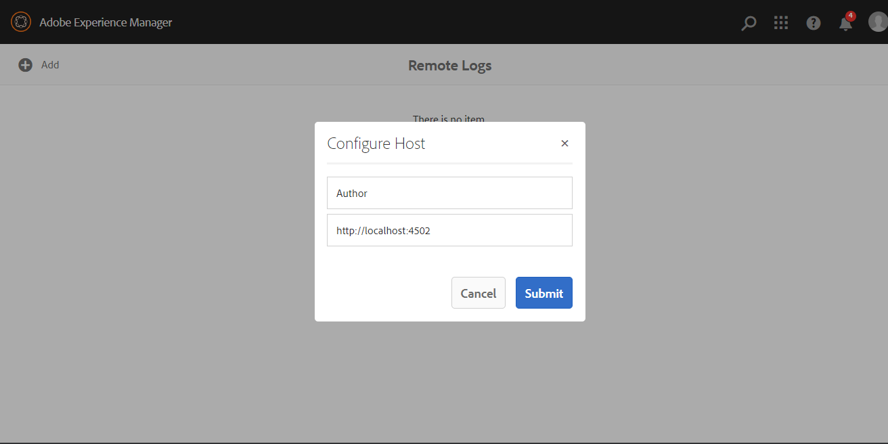
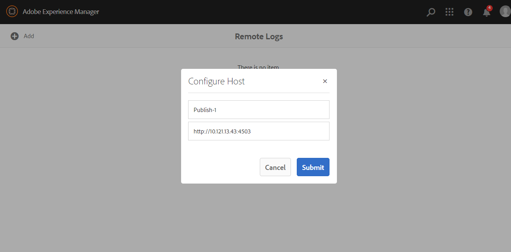

# AEM Log Viewer

## Motivation
Typically there are two options to view/download logs of a running AEM instance:
1. Copy logs from a remote AEM instance via scp.   
2. Use the [WebTail](https://sling.apache.org/documentation/development/logging.html#webtail) plugin in OSGi System Console.

Both options are typically restricted, e.g. in AMS and developers have to ask admins to download logs files.

This tool provides centralized access to log files of your AEM environment. All you need is access to AEM Author instance 
where you can configure the hosts from which you want to grab log files.

## Building

This project uses Maven for building. Common commands:

From the root directory, run ``mvn -PautoInstallPackage clean install`` to build the bundle and content package and install to a CQ instance.

## Usage

In AEM Author go to Tools / E2E Tools / Log Viewer or navigate to http://localhost:4502/apps/e2e-tools/content/log-viewer/dashboard.html
Open the dashboard and click the Add button .

The URL is the address of an AEM instance from the host eye view, i.e. to access the logs files of _self_ enter http://localhost:4502

To access the logs files of a publish instance enter its address:port. This is similar to how you configure replication agents.

Click on a host to see the files in remote crx-quickstart/logs directory:

